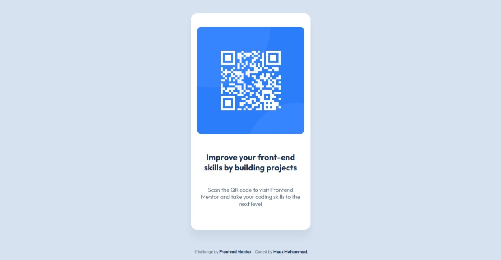

# Frontend Mentor - QR code component solution

This is a solution to the [QR code component challenge on Frontend Mentor](https://www.frontendmentor.io/challenges/qr-code-component-iux_sIO_H). Frontend Mentor challenges help you improve your coding skills by building realistic projects. 

## Table of contents

- [Overview](#overview)
  - [Screenshot](#screenshot)
  - [Links](#links)
- [My process](#my-process)
  - [Built with](#built-with)
  - [What I learned](#what-i-learned)
  - [Continued development](#continued-development)
  - [Useful resources](#useful-resources)
- [Author](#author)
- [Acknowledgments](#acknowledgments)

## Overview

### Screenshot



### Links

- [Solution URL](https://github.com/muaz64/QR-code-component.git)

- [Live Site URL](https://muaz64.github.io/QR-code-component/)

## My process

### Built with

- Semantic HTML5 markup
- CSS custom properties
- Flexbox
- Mobile-first workflow

### What I learned

I learned how to structure a clean, responsive card layout using Flexbox and custom properties. I also practiced using Google Fonts and applying consistent spacing and typography.

```css
.qr-card {
  background-color: white;
  border-radius: 1rem;
  box-shadow: 0 20px 20px rgba(0, 0, 0, 0.05);
}
```
### Continued development

I want to continue improving my CSS layout skills, especially with Grid and responsive design techniques. I also plan to explore accessibility best practices.


### Author

- Website - [Muaz Muhammad](https://muazmd.netlify.app)
- Frontend Mentor - [@muaz64](https://www.frontendmentor.io/profile/muaz64)

### Acknowledgments
Thanks to Frontend Mentor for providing this challenge. It was a great way to practice clean HTML and CSS structure
